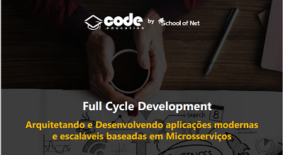
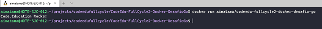

<p align="center">
  
</p>

<div align="center">


[](https://github.com/aimatama/CodeEdu-FullCycle2-Docker-DesafioGo/blob/master/LICENSE)<space> <space>

</div>

## 📑 Tabela de Conteúdos

- [Descrição do Exercício](#-Descrição-do-Exercício)
- [Docker Hub - Imagem Go Hello World](#-Docker-Hub-Imagem-Go-Hello-World)
- [Sobre o Curso Full Cycle Development](#-Sobre-o-Curso-Full-Cycle-Development)
- [Screenshots](#-Screenshots)
- [Status do projeto](#-Status-do-projeto)
- [Tecnologias utilizadas](#-Tecnologias-utilizadas)
- [Como executar o projeto](#-Como-executar-o-projeto)
- [Licença](#-Licença)
- [Contato](#-Contato)

---

## 💬 Descrição do Exercício

Esse desafio é muito empolgante principalmente se você nunca trabalhou com a linguagem Go!
Você terá que publicar uma imagem no docker hub. Quando executarmos:

docker run <seu-user>/codeeducation

Temos que ter o seguinte resultado: Code.education Rocks!

Se você perceber, essa imagem apenas realiza um print da mensagem como resultado final, logo, vale a pena dar uma conferida no próprio site da Go Lang para aprender como fazer um "olá mundo".

Lembrando que a Go Lang possui imagens oficiais prontas, vale a pena consultar o Docker Hub.

3) A imagem de nosso projeto Go precisa ter menos de 2MB =)

Dica: No vídeo de introdução sobre o Docker quando falamos sobre o sistema de arquivos em camadas, apresento uma imagem "raiz", talvez seja uma boa utilizá-la.

Divirta-se.

---

## 💬 Docker Hub - Imagem Go Hello World

A imagem finalizada criada na entrega do exercício está disponível no DockerHub (https://hub.docker.com/repository/docker/aimatama/codeedu-fullcycle2-docker-desafio-go).

---

## 💬 Sobre o Curso Full Cycle Development

O Curso Full Cycle Development da Code Education visa ajudar na prática programadores a desenvolverem as principais habilidades exigidas pelas empresas no mercado para que eles sejam capazes de trabalhar em projetos de grande porte com total confiança e desenvolvendo do jeito certo. Maiores informações em **[Maratona Full Cycle](https://pages.fullcycle.com.br/maratona-fullcycle-b2)**. Realizado em março de 2021.

---

## 🏁 Status do exercício

🏁 Finalizado!!! 🏆🏆🏆

---

## 🖥 Screenshots

<p align="center">
    
</p>

---

## 🚀 Tecnologias utilizadas

O projeto foi desenvolvido utilizando as seguintes tecnologias:

- [Docker](https://www.docker.com/)
- [Go](https://golang.org/)

---

## ▶️ Como executar o projeto

```
# Crie uma pasta para o projeto do exercício
> mkdir desafio-go

# Acesse a pasta do repositorio
> cd desafio-go

# Clone o repositório
git clone https://github.com/aimatama/CodeEdu-FullCycle2-Docker-DesafioGo.git

# Faça o build da imagem Docker
> docker build -t aimatama/codeedu-fullcycle2-docker-desafio-go .

# Execute o container da imagem criada
> docker run aimatama/codeedu-fullcycle2-docker-desafio-go

```
---

## 📜 Licença

O projeto está sob a licença [MIT](./LICENSE) ❤️

---

## ☎️ Contato

Para falar comigo:
<br/><br/>
[](https://www.linkedin.com/in/aimatama/)
[](mailto:aimatama@gmail.com)
<br/>
Gostou do projeto? Deixe uma estrelinha para ajudar!!! ⭐
